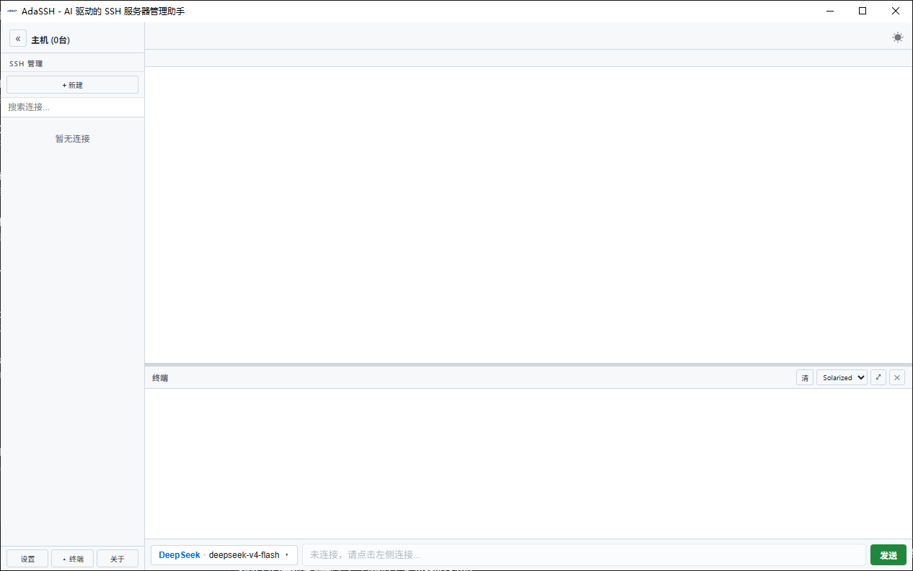

# AdaSSH

> AI 驱动的 SSH 服务器管理助手 — 让你用自然语言操作远程服务器

[](#-系统要求)
[](#-技术栈)
[](https://wails.io)
[](#-许可证)

一句话总结：**在你的 SSH 终端里住进一个会自己敲命令的 AI 助手。**

---

## 📖 这是什么

AdaSSH 是一个桌面应用，把传统的 SSH 客户端和 AI 对话合并到一个窗口里。

打开应用 → 选服务器 → 连上 → 你用中文问"服务器健康如何？"，AI 自己跑命令、看输出、给你分析结论。

不用再切换窗口、不用背命令、不用查文档。**AI 是你的副驾驶，SSH 通道是它能动的工具。**

---

## ✨ 它能做什么

### 🤖 AI 自动运维
- 问"磁盘还剩多少" → AI 跑 `df -h` 并解读结果
- 问"是不是被入侵了" → AI 跑 `last`, `netstat`, 翻日志做安全审计
- 问"这台机器的 nginx 怎么优化" → AI 检查配置、跑压测、给建议
- 问"数据库慢查询" → AI 查 slow log、定位索引问题
- 多步任务：让 AI 串联执行，自己排错

### 🖥️ SSH 连接管理
- 一键保存常用服务器（主机/端口/用户名/密码/密钥）
- 多个连接同时开，每个会话独立 tab 和终端
- 右键菜单：连接 / 编辑 / SFTP / 删除
- 批量操作：勾选多台一起改标签、改分组、批量删除
- 从 `~/.ssh/config` 一键导入

### 📁 SFTP 文件浏览器
- 图形化浏览远端文件系统
- 上传 / 下载 / 新建文件夹 / 新建文件 / 重命名 / 删除
- 大目录虚拟滚动（千行不卡）
- Tab 键自动补全路径

### 💬 终端
- 完整 xterm 终端，多种配色（默认 / Solarized / Tango / OneDark / Light）
- 选中即复制、`Ctrl+Shift+C/V` 粘贴
- 全屏模式 (`F11`)
- 多会话 LRU 管理（最多 5 个活跃 xterm，省内存）

### ⌨️ 高效操作
- **`Ctrl+K`** 调出命令面板，模糊搜索一切
- **`Ctrl+F`** 在当前会话里搜索历史消息
- 主题切换（深色 / 浅色）
- 响应式布局，窗口缩放自适应

---

## 🚀 三分钟上手

### 1. 安装

从 [Releases](https://github.com/yuwan-jpg/AdaSSH/releases) 下载对应平台的安装包：

- **Windows**: `adassh-windows-amd64.zip` → 解压运行 `adassh.exe`
- **macOS**: `adassh-macos-universal.zip` → 拖入 Applications
- **Linux**: `adassh-linux-amd64` → `chmod +x && ./adassh`

### 2. 添加第一台服务器

打开应用 → 左侧 "+ 新建"：

```
名称:     我的服务器
主机:     192.168.1.100
端口:     22
用户:     root
密码:     ********       （或选择密钥文件）
分组:     生产环境       （可选）
```

点保存。

### 3. 配置 AI 提供商

左侧 "设置" → API 提供商 → 添加：

```
名称:     OpenAI        （或 MiniMax / Anthropic / 自建中转）
API 地址: https://api.openai.com/v1
API 密钥: sk-...
```

点"拉取模型"自动获取模型列表，然后选一个用。

> 不知道怎么填？先随便填一个 `https://api.openai.com/v1` + 你的 key 试一下。

### 4. 开始对话

点击左侧服务器 → 连接到终端 → 在底部输入框打字：

```
磁盘还剩多少？
```

回车 → AI 自己跑命令 → 几秒后给你结果。**就这么简单。**

---

## 📚 使用教程

### 场景一：日常巡检

不用记命令，AI 会自己挑工具：

```
我: 服务器健康如何？
AI: （自动执行 uptime / df -h / free -h / top）
    总结：CPU 空闲，磁盘 78%，内存 64%，1 个 zombie 进程需要清理
```

### 场景二：故障排查

把症状告诉 AI，让它自己定位：

```
我: 昨晚 3 点网站挂了，帮我看看日志
AI: （执行 journalctl --since "3 hours ago"）
    找到 5 次 nginx worker 异常退出，原因是内存耗尽
    建议加 swap 或限制 worker 数量
```

### 场景三：文件操作

直接用 SFTP tab 上传下载，或者让 AI 帮忙：

```
我: 帮我把 /var/log/nginx/ 最近 100 行错误日志打包
AI: （执行 tar czf /tmp/nginx_errors.tar.gz /var/log/nginx/error.log 最近的行）
    已生成 /tmp/nginx_errors.tar.gz (12KB)
```

### 场景四：批量服务器操作

左侧勾选多台服务器 → 底部出现批量工具条 → 改标签 / 改分组 / 批量删除。

### 快捷键速查

| 快捷键 | 作用 |
|---|---|
| `Ctrl+K` | 命令面板（搜一切） |
| `Ctrl+F` | 在当前对话里搜索 |
| `Ctrl+L` | 清屏 |
| `F11` / `Esc` | 终端全屏 / 退出全屏 |
| `Ctrl+Shift+C` | 复制终端选中内容 |
| `Ctrl+Shift+V` | 粘贴到终端 |
| `Ctrl+T` | 新建连接 |
| `Ctrl+W` | 关闭当前 tab |

---

## 🖼️ 界面预览

点击查看仓库主页 → [](https://github.com/yuwan-jpg/AdaSSH)

> 主界面：左侧连接列表 / 中间终端 tab / 右侧 AI 对话面板
> 一图概览所有功能：连接管理、SSH 终端、SFTP、AI 自动运维。

---

## 🛠️ 技术栈

| 层 | 技术 |
|---|---|
| 桌面框架 | [Wails v2](https://wails.io) (Go + WebView) |
| 后端 | Go 1.25 + `golang.org/x/crypto/ssh` + `pkg/sftp` |
| AI 接入 | OpenAI 兼容协议（支持 GPT / DeepSeek / MiniMax / 自建中转） |
| 前端 | 原生 HTML/CSS/JS（**无框架**，不依赖 npm 打包） |
| 终端 | [xterm.js](https://xtermjs.org/) |
| 跨平台 | Windows (WebView2) / macOS (WebKit) / Linux (WebKitGTK) |

**为什么不用 Electron？** 体积小一个数量级（28 MB vs 200 MB+），启动更快，内存占用更低。

---

## ❓ 常见问题

**Q: AI 会不会乱删我的文件？**
A: 内置危险命令黑名单（`rm -rf /`, `dd of=/dev/...`, `mkfs`, 改 sshd_config 等），触发会弹确认框。

**Q: 我的 API key 安全吗？**
A: key 用本地加密存储（AES-GCM），加密密钥在 `.adassh_key` 文件。文件不会上传到任何地方。

**Q: AI 能不能访问我所有连接过的服务器？**
A: 只能访问当前激活的 session。切换 tab 后，AI 看到的是新 session 的命令历史。

**Q: 离线能用吗？**
A: 终端和 SFTP 离线可用，但 AI 需要联网。

**Q: 支持自托管 LLM 吗？**
A: 支持。任何 OpenAI 兼容 API（Ollama / vLLM / LM Studio / 一键中转）都能接入。

**Q: 比 MobaXterm / Termius 好在哪？**
A: 多了一个能听懂自然语言的副驾驶。其它 SSH 客户端需要你会命令，AdaSSH 让 AI 替你执行。

---

## ⚠️ 免责声明

**请仔细阅读，使用本软件即表示您同意以下条款：**

1. **AI 操作不可全信**
   AI 生成的命令基于概率模型，可能理解错你的意图、跑错命令、给出错误判断。所有 AI 建议和执行的命令，**你应该自己先看一遍再批准**，特别是在生产服务器上。

2. **数据安全**
   - 你的连接信息、API key、对话历史都存在本地
   - 这些数据**不会上传**到任何第三方服务器
   - AI 调用走的是你配置的 provider，AI 提供商会看到你发的命令和服务器返回的内容
   - **敏感服务器（生产环境 / 含个人数据的）慎用 AI 直接操作**

3. **工具本身不做越权**
   AdaSSH 只是 SSH 客户端 + AI 调用层的封装，**不存储、不中转、不备份**你的服务器数据。服务器被搞坏、被入侵、数据丢失，**我们不承担责任**。

4. **不保证可用性**
   本软件按"原样"提供，不保证无错误、不中断、满足你的需求。功能可能随时变更、停止维护。

5. **遵守当地法律**
   - 用本软件做的事情由你本人负责
   - 请确保你有权访问你连接的所有服务器
   - 未经授权访问他人系统是违法的

6. **第三方服务**
   你选的 AI provider（OpenAI / Anthropic / 国内中转 / 自建等）的服务条款、隐私政策与本项目无关，**我们不为它们的任何行为负责**。

7. **不收集任何遥测**
   本项目没有内置任何统计、追踪、广告。代码完全开源可审计。

---

## 💬 联系方式

- 仓库主页: [github.com/yuwan-jpg/AdaSSH](https://github.com/yuwan-jpg/AdaSSH)
- Issues: [GitHub Issues](https://github.com/yuwan-jpg/AdaSSH/issues)

---

<div align="center">

如果这个项目帮到了你，给个 ⭐ Star 鼓励一下 ✨

Made with ❤️ by AdaSSH Contributors

</div>
